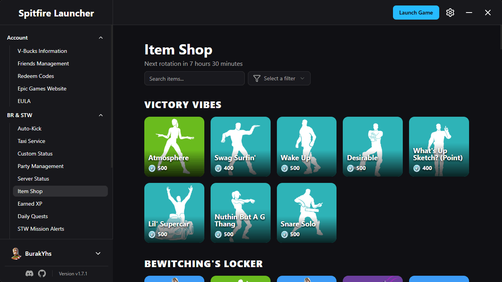

# Spitfire Launcher

A launcher for Fortnite Battle Royale and Save the World




## Installation

Download the latest release from the [releases page](https://github.com/bur4ky/spitfire-launcher/releases/latest) or from [our website](https://rookie-spitfire.xyz/launcher).

## Key Features

- Multiple account support
- Multiple language support: German, English, French, Spanish, Portuguese and Turkish
- Taxi service: Play STW missions above your power level
- Auto-kick: Kick instantly, auto-claim rewards, auto-transfer materials and auto-invite your friends when the STW mission ends
- Download games: Download and launch games from the Epic Games Store
- View item shop, STW quests and mission alerts
- Friend management
- Authentication: Generate access tokens, exchange codes and device auths for your account

## Bug Reports & Feature Requests

You can report bugs and request features either through [GitHub Issues](https://github.com/bur4ky/spitfire-launcher/issues) or on our [Discord](https://discord.gg/rAUbXf5xUZ).

Before creating a report, please check if it has already been submitted to avoid duplicates.  
When reporting bugs, keep **Enable Debug Logs** turned on and include as much detail as possible (logs, steps to reproduce, screenshots, etc.).

Logs can be found in F12 -> Console.

## Translating

You can help us translate the launcher on [Crowdin](https://crowdin.com/project/rookie-spitfire).  
If you also join our [Discord](https://discord.gg/rAUbXf5xUZ), you will get the Translator role.

## Development Setup

### Prerequisites

1. **Install Bun**
   - Windows:
     ```powershell
     powershell -c "irm bun.sh/install.ps1 | iex"
     ```
   - Linux & macOS:
     ```sh
     curl -fsSL https://bun.sh/install | bash
     ```

2. **Setup Tauri**
   - Follow the official prerequisites guide:  
     https://v2.tauri.app/start/prerequisites

### Configuring Android

To build the launcher for Android, you’ll need to create and configure a signing keystore.

Follow the official Tauri guide [here](https://v2.tauri.app/distribute/sign/android/#configure-the-signing-key).

You can skip the Gradle steps since it is already configured.

### Running the App

```sh
bun install
bun tauri dev
# bun tauri android dev
```

## License

This project is licensed under the GNU General Public License v3.0 – see the [LICENSE](LICENSE) file for details.
